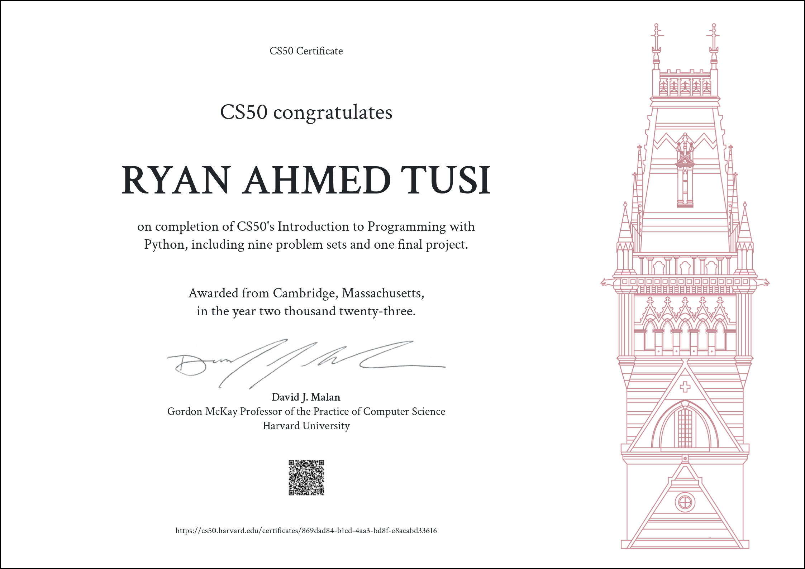

# CS50Python
Welcome to the CS50 Python repository! Here, you'll find solutions to problem sets and lab exercises from Harvard's CS50P course, organized neatly into weekly folders.
🐍Embark on a code odyssey with this repository, a meticulously curated collection housing solutions to problem sets from Harvard's esteemed CS50 Python course. Delve into the depths of Python programming excellence, guided by the renowned CS50 curriculum. Welcome to the intersection of learning and elegance in code. 🌟🔍💻

## Folder Structure:

### Week 1
- `einstein`
- `faces`
- `indoor`
- `playback`
- `tip`

### Week 2
- `bank`
- `deep`
- `extensions`
- `interpreter`
- `meal`

### Week 3
- `camel`
- `coke`
- `nutrition`
- `plates`
- `twttr`

### Week 4
- `fuel`
- `grocery`
- `outdates`
- `taqueria`

### Week 5
- `adieu`
- `bitcoin`
- `emojize`
- `figlet`
- `game`
- `professor`

### Week 6
- `test_bank`
- `test_plates`
- `test_fuel`
- `test_twttr`

### Week 7
- `lines`
- `pizza`
- `scourgify`
- `shirt`

### Week 8
- `numb3rs`
- `response`
- `um`
- `watch`
- `working`

### Week 9
- `jar`
- `seasons`
- `shirtificate`

## How to Use:

1. **Navigate:** Explore the folders corresponding to each week to access problem set solutions.
2. **Learn:** Review the code to understand Python concepts and problem-solving approaches.
3. **Contribute:** Feel free to contribute your own solutions or improvements via pull requests.
4. **Download CS50 package:** `pip install cs50` in your own IDE 

## Certification

## 🚀 Getting Started:

If you're taking CS50P or simply interested in Python programming, this repository can serve as a valuable resource to understand problem-solving techniques and Python applications.

Feel free to explore, learn, and contribute to this repository! Happy coding! 🐍✨
